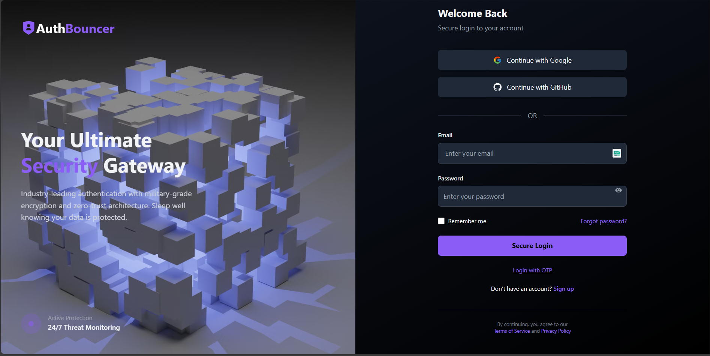
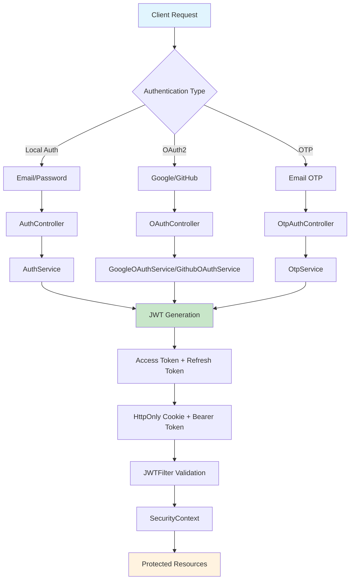
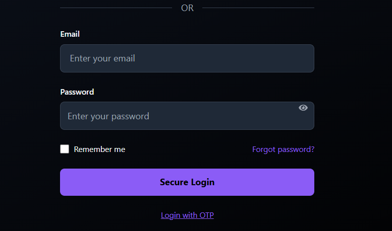
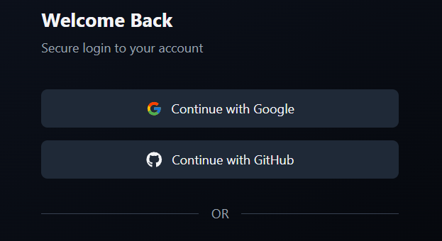
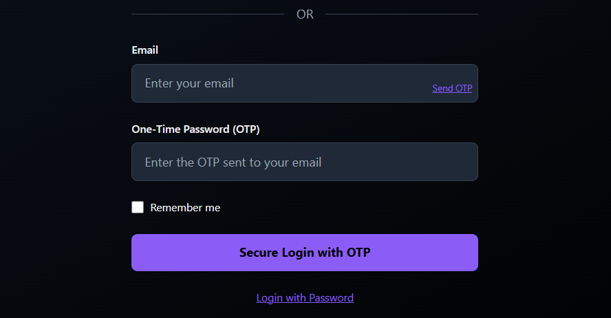
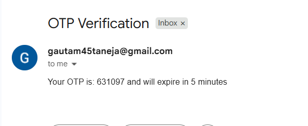
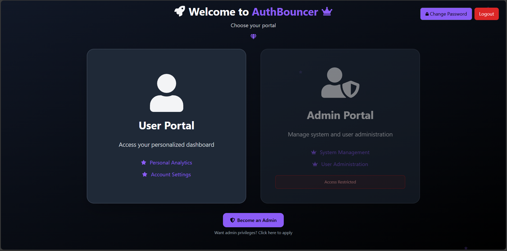
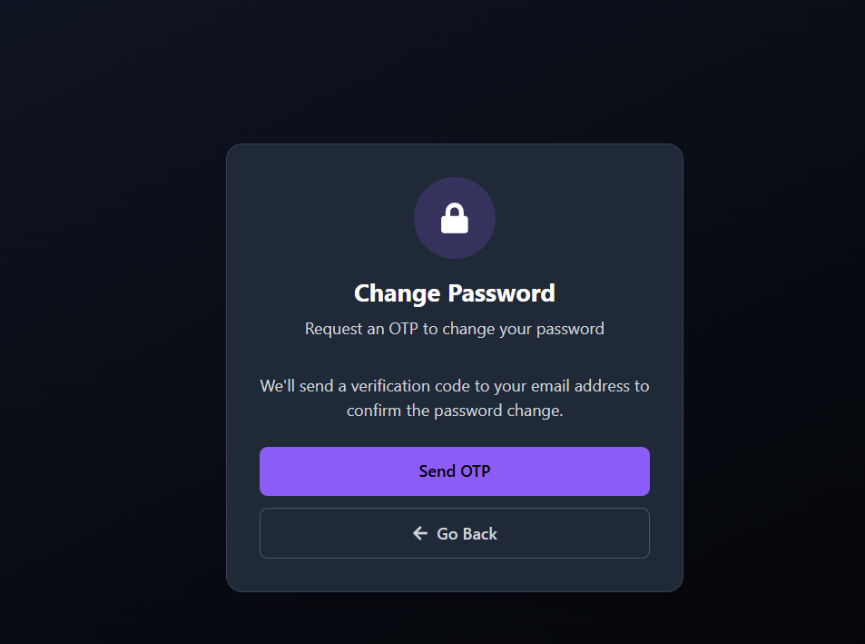

# 🔐 Auth-Bouncer: Enterprise Authentication Powerhouse

> **Spring Boot 3.5.3 + React 19 | Production-Ready Authentication System**  
> *Don't like the theme? Hit refresh and watch the magic happen! ✨*

---

## 🎯 **The Complete Authentication Experience**

### 🏠 **Homepage - Where It All Begins**


**What's happening behind the scenes?** Our Spring Boot backend serves this sleek interface while managing complex authentication flows, JWT token generation, and secure session handling.

---

### 🎯 **Authentication Flow Architecture**


## 🔑 **Multiple Authentication Methods - Backend Flexibility at Its Finest**

### 📧 **Traditional Email/Password Authentication**


**Backend Magic:**
- **BCrypt Password Hashing** (Strength: 12) for maximum security
- **JWT Access + Refresh Token** dual-layer system
- **HttpOnly Secure Cookies** for refresh token storage
- **Real-time validation** with Spring Security filters

### 🌐 **OAuth2 Social Login - Seamless Integration**


**Backend Powerhouse Features:**
- **Google OAuth2** complete flow implementation
- **GitHub OAuth2** with email verification
- **Automatic user provisioning** for new social accounts
- **Token exchange** and secure user info retrieval
- **RestTemplate** integration for external API calls

### 📱 **OTP Authentication - Email-Based Security**


**Advanced Backend Implementation:**
- **Random OTP generation** with secure algorithms
- **Gmail SMTP integration** for email delivery
- **Time-based expiration** handling
- **Redis caching** for OTP storage and validation

---

## 📨 **Real-World Email Integration**

### 📧 **OTP Email Delivery in Action**


**Backend Email Service Features:**
- **Gmail SMTP** configuration with app passwords
- **HTML email templates** for professional communication
- **Delivery confirmation** and error handling
- **Rate limiting** to prevent spam

### 🔄 **OTP Resend Functionality**


**Smart Backend Logic:**
- **Cooldown periods** to prevent abuse
- **Automatic cleanup** of expired OTPs
- **Retry mechanisms** with exponential backoff

---

## 🛡️ **Role-Based Access Control (RBAC) - Security Architecture**

### 👑 **Admin Dashboard - Elevated Privileges**


**Backend Security Implementation:**
- **Spring Security** role-based endpoint protection
- **JWT Claims** with role information
- **Method-level security** annotations
- **Hierarchical permission** system

**Protected Endpoints:**
- `/api/is-admin/**` - Admin-only resources
- `/api/is-user/**` - User-level access
- **Dynamic role checking** in JWT filter

---

## 🔐 **Advanced Security Features**

### 🔑 **Password Management System**


**Backend Security Measures:**
- **Current password verification** before changes
- **BCrypt re-hashing** with salt rotation
- **Session invalidation** after password change
- **Audit logging** for security events

---

## 🏗️ **Backend Architecture - The Real MVP**

### 🚀 **Spring Boot 3.5.3 Powerhouse**
```
🔧 Core Technologies:
├── Java 21 (Latest LTS)
├── Spring Security 6
├── PostgreSQL + JPA
├── Redis Caching
├── JWT (jjwt 0.12.6)
└── Maven Build System
```
---

## 🔥 **Backend Service Architecture**


#### 🛡️ **AuthService - The Authentication Brain**
- User registration with duplicate validation
- Secure login with BCrypt verification  
- JWT token generation and refresh rotation
- HttpOnly cookie management for security

#### 🎫 **JWTService - Token Management Master**
- Access token generation (15-minute expiry)
- Refresh token handling (7-day rotation)
- Claims parsing and validation
- Signature verification with HMAC-SHA256

#### 🌐 **OAuth Services - Social Integration Experts**
- **GoogleOAuthService**: Complete OAuth2 flow
- **GithubOAuthService**: GitHub authentication
- Token exchange with external providers
- User profile synchronization

#### 📧 **OtpService - Email Security Specialist**
- Cryptographically secure OTP generation
- SMTP email delivery with templates
- Time-based expiration management
- Anti-spam protection mechanisms

---

## 🗄️ **Database & Caching Strategy**

### 📊 **PostgreSQL Data Layer**
- **User Entity** with audit trails
- **Role-based** permission system
- **Provider tracking** (LOCAL, GOOGLE, GITHUB)
- **Automatic timestamps** with JPA auditing

### ⚡ **Redis Caching Layer**
- **Session management** for scalability
- **OTP storage** with TTL expiration
- **Rate limiting** data structures
- **Performance optimization** for frequent queries

---

## 🔐 **Security Implementation Deep Dive**

### 🛡️ **Multi-Layer Security Architecture**

#### **Layer 1: Request Filtering**
- Custom JWT filter intercepts all requests
- Bearer token extraction and validation
- Security context population
- CORS configuration for cross-origin requests

#### **Layer 2: Authentication Management**
- Spring Security authentication provider
- BCrypt password encoder (strength 12)
- UserDetailsService integration
- Session management (stateless)

#### **Layer 3: Authorization Control**
- Role-based method security
- Endpoint-level access control
- Dynamic permission checking
- Audit trail logging

---

## 🚀 **API Endpoints - RESTful Excellence**

### 🎯 **Authentication Endpoints**
| Method | Endpoint | Purpose | Security |
|--------|----------|---------|----------|
| `POST` | `/api/auth/register` | User Registration | Public |
| `POST` | `/api/auth/login` | Email/Password Login | Public |
| `POST` | `/api/auth/refresh` | Token Refresh | Cookie Auth |
| `POST` | `/api/auth/logout` | Secure Logout | Cookie Auth |
| `POST` | `/api/auth/google/callback` | Google OAuth2 | Public |
| `POST` | `/api/auth/github/callback` | GitHub OAuth2 | Public |
| `POST` | `/api/auth/request-otp` | OTP Generation | Public |
| `POST` | `/api/auth/verify-otp` | OTP Verification | Public |

### 🔒 **Protected Resources**
| Endpoint Pattern | Required Role | Description |
|------------------|---------------|-------------|
| `/api/is-user/**` | USER | User-level resources |
| `/api/is-admin/**` | ADMIN | Admin-only resources |
| `/api/health/**` | Public | Health checks |

---

## ⚙️ **Configuration & Environment**

### 🔧 **Backend Configuration Highlights**
- **JWT Secret Management** with environment variables
- **Database Connection Pooling** for performance
- **CORS Configuration** for frontend integration
- **Email SMTP Settings** with Gmail integration
- **OAuth2 Client Credentials** management

### 🌍 **Environment Setup**
```bash
# Backend Power-Up
cd AB-Backend
mvn clean install
mvn spring-boot:run

# Frontend Launch
cd AB-Frontend  
npm install
npm run dev
```

---

## 📊 **Performance & Scalability**

### ⚡ **Optimization Features**
- **Connection Pooling** with HikariCP
- **Redis Caching** for session data
- **JWT Stateless** authentication
- **Lazy Loading** with JPA
- **Async Processing** for email delivery

### 📈 **Scalability Considerations**
- **Horizontal scaling** ready architecture
- **Database indexing** on critical fields
- **Caching strategies** for frequent queries
- **Load balancer** compatible design

---

## 🧪 **Development & Testing**

### 🔍 **Backend Testing Strategy**
- **Unit Tests** for service layer
- **Integration Tests** for controllers
- **Security Tests** for authentication flows
- **Performance Tests** for load handling

### 🛠️ **Development Tools**
- **Spring Boot DevTools** for hot reload
- **Lombok** for boilerplate reduction
- **Maven** for dependency management
- **PostgreSQL** for development database

---

## 🚀 **Production Deployment**

### 🔒 **Security Hardening**
- Environment-specific JWT secrets
- HTTPS enforcement
- Rate limiting implementation
- SQL injection prevention
- XSS protection headers

### 📊 **Monitoring & Logging**
- Application performance monitoring
- Security audit logging
- Error tracking and alerting
- Health check endpoints

---

## 🎉 **Why Auth-Bouncer Rocks**

### 💪 **Backend Strengths**
- **Enterprise-Grade Security** with multiple authentication methods
- **Scalable Architecture** built with Spring Boot best practices  
- **Production-Ready** with comprehensive error handling
- **Developer-Friendly** with clean, well-documented code
- **Modern Stack** using latest Java 21 and Spring Boot 3.5.3

### 🌟 **Key Differentiators**
- **Multi-Authentication Support** (Local, OAuth2, OTP)
- **Robust JWT Implementation** with refresh token rotation
- **Real Email Integration** with Gmail SMTP
- **Role-Based Security** with fine-grained permissions
- **Caching Strategy** with Redis for performance

---

**🔥 Built by a passionate developer who believes in secure, scalable, and beautiful code**  
*Powered by Spring Boot 3.5.3 + React 19 - The perfect full-stack combination*

---

*Don't forget to hit that refresh button and see the theme magic! ✨*