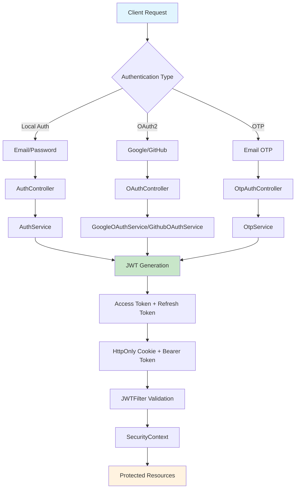

# 🔐 Auth-Bouncer: Enterprise-Grade Authentication System

> **A robust, production-ready authentication system built with Spring Boot 3.5.3 and React 19**  
> *Don't like the theme? Hit refresh and watch the magic happen! ✨*


## 🚀 Live Demo & Screenshots

### 🎯 Homepage Experience
The Auth-Bouncer landing page features a sleek, modern design with dynamic theme switching. Each refresh brings a new visual experience while maintaining the professional authentication interface.


---

## 📊 Authentication Flow Architecture



---

## 🛠️ Technology Stack

### 🔧 Backend Powerhouse
- **Framework**: Spring Boot 3.5.3 with Java 21
- **Security**: Spring Security 6 with JWT (jjwt 0.12.6)
- **Database**: PostgreSQL with Spring Data JPA
- **Caching**: Redis for session management
- **Email**: Gmail SMTP integration
- **OAuth2**: Google & GitHub providers
- **Password**: BCrypt encryption (strength: 12)
- **Build Tool**: Maven with Lombok

### 🎨 Frontend Excellence
- **Framework**: React 19 with Vite
- **Styling**: Tailwind CSS
- **Routing**: React Router DOM 7.6.3
- **Icons**: React Icons 5.5.0
- **State**: Context API with custom hooks

---

## 🏗️ Backend Architecture Deep Dive

### 🔐 Security Configuration
```java
@Configuration
@EnableWebSecurity
public class SecurityConfig {
    // JWT-based stateless authentication
    // Role-based access control (USER/ADMIN)
    // CORS configuration for cross-origin requests
    // Custom JWT filter integration
}
```

### 🎯 Authentication Controllers

#### 1. **AuthController** - Core Authentication
- `POST /api/auth/register` - User registration with validation
- `POST /api/auth/login` - Email/password authentication
- `POST /api/auth/refresh` - JWT token refresh
- `POST /api/auth/logout` - Secure session termination

#### 2. **OAuthController** - Social Authentication
- `POST /api/auth/google/callback` - Google OAuth2 integration
- `POST /api/auth/github/callback` - GitHub OAuth2 integration

#### 3. **OtpAuthController** - OTP Authentication
- `POST /api/auth/request-otp` - Generate and send OTP via email
- `POST /api/auth/verify-otp` - Verify OTP and issue tokens

### 🔧 Service Layer Architecture

#### **AuthService** - Core Authentication Logic
- User registration with duplicate validation
- Secure password hashing with BCrypt
- JWT token generation and management
- HttpOnly cookie implementation for refresh tokens

#### **JWTService** - Token Management
- Access token generation (configurable expiration)
- Refresh token handling with rotation
- Token validation and parsing
- Claims extraction (email, role, expiration)

#### **OAuth Services** - External Provider Integration
- **GoogleOAuthService**: Complete Google OAuth2 flow
- **GithubOAuthService**: GitHub authentication integration
- Automatic user creation for new OAuth users
- Token exchange and user info retrieval

#### **OtpService** - One-Time Password System
- Random OTP generation and storage
- Email delivery via Gmail SMTP
- Time-based expiration handling
- Secure verification process

### 🗄️ Data Models

#### **User Entity**
```java
@Entity
@Table(name="users")
public class User extends DateAudit {
    private Long id;
    private String email;        // Unique identifier
    private String username;     // Display name
    private String password;     // BCrypt hashed
    private Role role;          // ROLE_USER, ROLE_ADMIN
    private AuthProvider provider; // LOCAL, GOOGLE, GITHUB
    private Boolean isVerified;  // Email verification status
}
```

#### **Audit Trail System**
- Automatic creation and modification timestamps
- User activity tracking
- Database-level audit logging

---

## 🔒 Security Features

### 🛡️ Multi-Layer Security
1. **JWT Implementation**
   - Access tokens (short-lived, 15 minutes)
   - Refresh tokens (long-lived, 7 days)
   - HttpOnly cookies for refresh token storage
   - Secure, SameSite=None configuration

2. **Password Security**
   - BCrypt hashing with strength 12
   - Password confirmation validation
   - Secure password reset flow

3. **OAuth2 Integration**
   - Google OAuth2 with proper scope handling
   - GitHub OAuth2 with email verification
   - Automatic user provisioning
   - Secure token exchange

4. **Request Filtering**
   - Custom JWT filter for token validation
   - CORS configuration for frontend integration
   - Role-based endpoint protection
   - Stateless session management

### 🔐 API Security Endpoints

#### Public Endpoints
- `/api/auth/**` - Authentication endpoints
- `/api/health/**` - Health check endpoints

#### Protected Endpoints
- `/api/is-user/**` - USER role required
- `/api/is-admin/**` - ADMIN role required

---

## 🚀 Getting Started

### Prerequisites
- Java 21+
- Node.js 18+
- PostgreSQL 13+
- Redis 6+
- Maven 3.8+

### Backend Setup
```bash
cd AB-Backend
mvn clean install
mvn spring-boot:run
```

### Frontend Setup
```bash
cd AB-Frontend
npm install
npm run dev
```

### Environment Configuration
Create `.env` files in both backend and frontend directories with the required configuration:

**Backend (.env)**
```properties
# Database Configuration
DB_URL=jdbc:postgresql://localhost:5432/authbouncer
DB_USERNAME=your_db_user
DB_PASSWORD=your_db_password

# JWT Configuration
JWT_SECRET=your-256-bit-secret-key
JWT_ACCESS_EXPIRATION=900000
JWT_REFRESH_EXPIRATION=604800000

# OAuth2 Configuration
GOOGLE_CLIENT_ID=your-google-client-id
GOOGLE_CLIENT_SECRET=your-google-client-secret
GITHUB_CLIENT_ID=your-github-client-id
GITHUB_CLIENT_SECRET=your-github-client-secret

# Email Configuration
MAIL_USERNAME=your-gmail@gmail.com
MAIL_PASSWORD=your-app-password
```

**Frontend (.env)**
```properties
VITE_API_BASE_URL=http://localhost:8080
```

---

## 📡 API Documentation

### Authentication Endpoints

#### Register User
```http
POST /api/auth/register
Content-Type: application/json

{
  "username": "johndoe",
  "email": "john@example.com",
  "password": "SecurePass123",
  "confirmPassword": "SecurePass123"
}
```

#### Login User
```http
POST /api/auth/login
Content-Type: application/json

{
  "email": "john@example.com",
  "password": "SecurePass123"
}
```

#### Refresh Token
```http
POST /api/auth/refresh
Cookie: jwtToken=your-refresh-token
```

#### OAuth2 Callback
```http
POST /api/auth/google/callback?code=oauth-authorization-code
POST /api/auth/github/callback?code=oauth-authorization-code
```

#### OTP Authentication
```http
POST /api/auth/request-otp
Content-Type: application/json

{
  "email": "john@example.com"
}
```

```http
POST /api/auth/verify-otp
Content-Type: application/json

{
  "email": "john@example.com",
  "otp": "123456"
}
```

---

## 🎨 Frontend Features

### 🖥️ User Interface
- **Responsive Design**: Mobile-first approach with Tailwind CSS
- **Dynamic Theming**: Refresh for new visual experiences
- **Interactive Tutorial**: First-time user guidance
- **Role-Based Dashboards**: Separate interfaces for users and admins

### 🔄 State Management
- **AuthContext**: Centralized authentication state
- **Custom Hooks**: Reusable authentication logic
- **Local Storage**: Persistent user preferences
- **Error Handling**: Comprehensive error boundaries

### 🛣️ Routing System
- Protected routes with authentication guards
- OAuth callback handling
- Role-based navigation
- Automatic redirects based on auth state

---

## 🧪 Testing & Development

### Backend Testing
```bash
cd AB-Backend
mvn test
```

### Frontend Testing
```bash
cd AB-Frontend
npm run lint
```

### Development Mode
- Backend: Hot reload with Spring Boot DevTools
- Frontend: Vite HMR for instant updates
- Database: PostgreSQL with connection pooling
- Caching: Redis for session management

---

## 🚀 Deployment

### Production Considerations
1. **Security Hardening**
   - Environment-specific JWT secrets
   - HTTPS enforcement
   - Rate limiting implementation
   - SQL injection prevention

2. **Performance Optimization**
   - Database connection pooling
   - Redis caching strategy
   - JWT token optimization
   - Static asset compression

3. **Monitoring & Logging**
   - Application performance monitoring
   - Security audit logging
   - Error tracking and alerting
   - Health check endpoints

---

## 🤝 Contributing

This project represents a comprehensive authentication solution built with modern technologies and best practices. The backend showcases enterprise-grade security implementations while the frontend provides an intuitive user experience.

### Key Highlights
- **Production-Ready**: Comprehensive error handling and validation
- **Scalable Architecture**: Modular design with clear separation of concerns
- **Security-First**: Multiple authentication methods with robust token management
- **Developer-Friendly**: Well-documented code with clear naming conventions
- **Modern Stack**: Latest versions of Spring Boot, React, and supporting libraries

---

## 📄 License

This project is developed as a demonstration of modern authentication systems and best practices in full-stack development.

---

**Built with ❤️ by a passionate developer**  
*Showcasing the power of Spring Boot 3.5.3 and React 19*