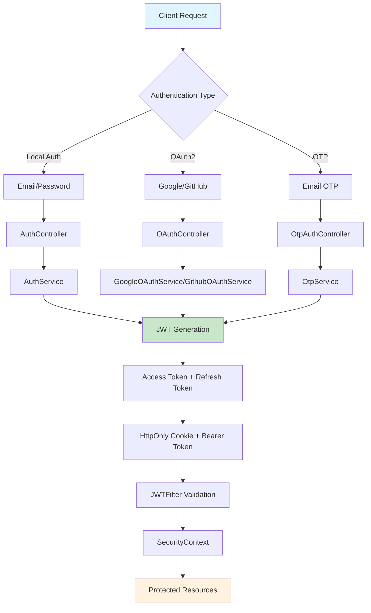

# Auth-Bouncer

Spring Boot 3.5.3 + React 19 authentication system with local, OAuth2, and OTP login flows.

---

## Homepage


The Spring Boot backend serves this interface while handling authentication flows, JWT token generation, and session management.

---

## Authentication Flow


```mermaid
graph TB
    A[Client Request] --> B{Authentication Type}
    
    B -->|Local Auth| C[Email/Password]
    B -->|OAuth2| D[Google/GitHub]
    B -->|OTP| E[Email OTP]
    
    C --> F[AuthController]
    D --> G[OAuthController]
    E --> H[OtpAuthController]
    
    F --> I[AuthService]
    G --> J[GoogleOAuthService/GithubOAuthService]
    H --> K[OtpService]
    
    I --> L[JWT Generation]
    J --> L
    K --> L
    
    L --> M[Access Token + Refresh Token]
    M --> N[HttpOnly Cookie + Bearer Token]
    
    N --> O[JWTFilter Validation]
    O --> P[SecurityContext]
    P --> Q[Protected Resources]
    
    style A fill:#e1f5fe
    style L fill:#c8e6c9
    style Q fill:#fff3e0
```

## Authentication Methods

### Email/Password


- BCrypt password hashing (strength 12)
- JWT access + refresh token pair
- HttpOnly secure cookies for refresh token storage
- Validation via Spring Security filters

### OAuth2 Social Login


- Google OAuth2 flow
- GitHub OAuth2 with email verification
- Automatic user provisioning for new social accounts
- Token exchange and user info retrieval via RestTemplate

### OTP Authentication


- Random OTP generation
- Gmail SMTP delivery
- Time-based expiration
- Redis caching for OTP storage and validation

---

## Email Integration

### OTP Delivery


- Gmail SMTP configured with app passwords
- HTML email templates
- Delivery confirmation and error handling
- Rate limiting to prevent spam

### OTP Resend


- Cooldown periods to prevent abuse
- Automatic cleanup of expired OTPs
- Retry with exponential backoff

---

## Role-Based Access Control

### Admin Dashboard


- Spring Security role-based endpoint protection
- JWT claims carry role information
- Method-level security annotations
- Hierarchical permission system

**Protected endpoints:**
- `/api/is-admin/**` — admin-only resources
- `/api/is-user/**` — user-level access
- Role checking happens in the JWT filter

---

## Password Management


- Current password verification before changes
- BCrypt re-hashing with salt rotation
- Session invalidation after password change
- Audit logging for security events

---

## Backend Architecture

```
Core Technologies:
├── Java 21 (LTS)
├── Spring Security 6
├── PostgreSQL + JPA
├── Redis Caching
├── JWT (jjwt 0.12.6)
└── Maven
```

## Service Layer

**AuthService**
- User registration with duplicate validation
- Login with BCrypt verification
- JWT generation and refresh rotation
- HttpOnly cookie management

**JWTService**
- Access token generation (15-minute expiry)
- Refresh token handling (7-day rotation)
- Claims parsing and validation
- HMAC-SHA256 signature verification

**OAuth Services**
- GoogleOAuthService — full OAuth2 flow
- GithubOAuthService — GitHub authentication
- Token exchange with external providers
- User profile sync

**OtpService**
- OTP generation
- SMTP email delivery with templates
- Time-based expiration
- Anti-spam protection

---

## Database and Caching

**PostgreSQL**
- User entity with audit trails
- Role-based permission system
- Provider tracking (LOCAL, GOOGLE, GITHUB)
- Automatic timestamps via JPA auditing

**Redis**
- Session management for scalability
- OTP storage with TTL expiration
- Rate limiting data structures
- Caching for frequent queries

---

## Security Architecture

**Request filtering**
- Custom JWT filter intercepts requests
- Bearer token extraction and validation
- Security context population
- CORS configuration for cross-origin requests

**Authentication**
- Spring Security authentication provider
- BCrypt password encoder (strength 12)
- UserDetailsService integration
- Stateless session management

**Authorization**
- Role-based method security
- Endpoint-level access control
- Dynamic permission checking
- Audit trail logging

---

## API Endpoints

### Authentication

| Method | Endpoint | Purpose | Security |
|--------|----------|---------|----------|
| `POST` | `/api/auth/register` | User registration | Public |
| `POST` | `/api/auth/login` | Email/password login | Public |
| `POST` | `/api/auth/refresh` | Token refresh | Cookie auth |
| `POST` | `/api/auth/logout` | Logout | Cookie auth |
| `POST` | `/api/auth/google/callback` | Google OAuth2 | Public |
| `POST` | `/api/auth/github/callback` | GitHub OAuth2 | Public |
| `POST` | `/api/auth/request-otp` | OTP generation | Public |
| `POST` | `/api/auth/verify-otp` | OTP verification | Public |

### Protected Resources

| Endpoint Pattern | Required Role | Description |
|------------------|---------------|-------------|
| `/api/is-user/**` | USER | User-level resources |
| `/api/is-admin/**` | ADMIN | Admin-only resources |
| `/api/health/**` | Public | Health checks |

---

## Configuration

- JWT secret management via environment variables
- Database connection pooling
- CORS configuration for frontend integration
- Gmail SMTP settings
- OAuth2 client credentials

### Running locally

```bash
# Backend
cd AB-Backend
mvn clean install
mvn spring-boot:run

# Frontend
cd AB-Frontend  
npm install
npm run dev
```

---

## Performance

- HikariCP connection pooling
- Redis caching for session data
- Stateless JWT auth
- Lazy loading with JPA
- Async processing for email delivery

Built with a horizontally scalable, load-balancer-friendly architecture and indexed database fields.

---

## Testing

- Unit tests for the service layer
- Integration tests for controllers
- Security tests for auth flows
- Performance tests for load handling

Development tools: Spring Boot DevTools, Lombok, Maven, PostgreSQL.

---

## Production Notes

**Security hardening**
- Environment-specific JWT secrets
- HTTPS enforcement
- Rate limiting
- SQL injection prevention
- XSS protection headers

**Monitoring**
- Application performance monitoring
- Security audit logging
- Error tracking and alerting
- Health check endpoints

---

## Summary

Auth-Bouncer supports local, OAuth2, and OTP authentication with JWT access/refresh tokens, role-based access control, and Redis-backed session and OTP handling. Built with Spring Boot 3.5.3 and Java 21 on the backend, React 19 on the frontend.
